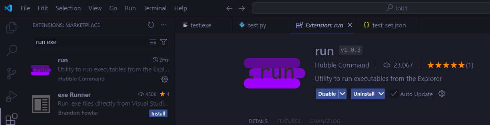

# To use this program
You have to put **test.exe** and **test_set.json** at the same directory with files which you want to test
```
. Root (Working Directory)
├── q1_1.py
├── q1_2.py
├── q1_3.py
├── ... .py
├── console-tester.exe
└── test_set.json

```

## Run in VSCode
### You have to 
install `run extension` in VSCode

<p align="center">
  
</p>

### open 
`console-tester.exe` in file explorer

<p align="center">
  
</p>

## Drag and Drop Function
You can simply drag the Python source file `.py` with same set_name provided in `test_set.json` on to the executable `.exe` to automatically test that script.

**Note that it is important to set setname in test_set.json to be the same name with file.py which you want to test**
<p align="center">
  
</p>

# About test_set.json
`test_set.json` use to store test set data in array of json
```json
[
  {
    "setname": string,
    "describe": string,
    "testcase": [object]
  },
  {
    "setname": "set1",
    "describe": "this set use with question 1",
    "testcase": [
                  {
                    "input": "3 2",
                    "expected_output": "5"
                  },
                  {
                    "input": "4 1",
                    "expected_output": "5"
                  },
                ]
  },
]
```
### so you can edit your test in this

